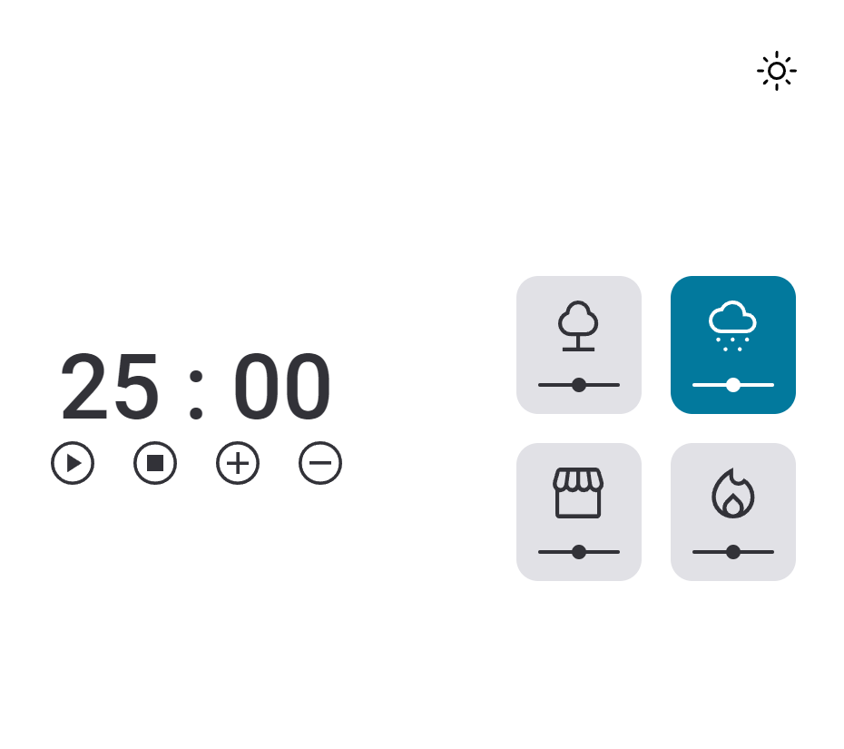
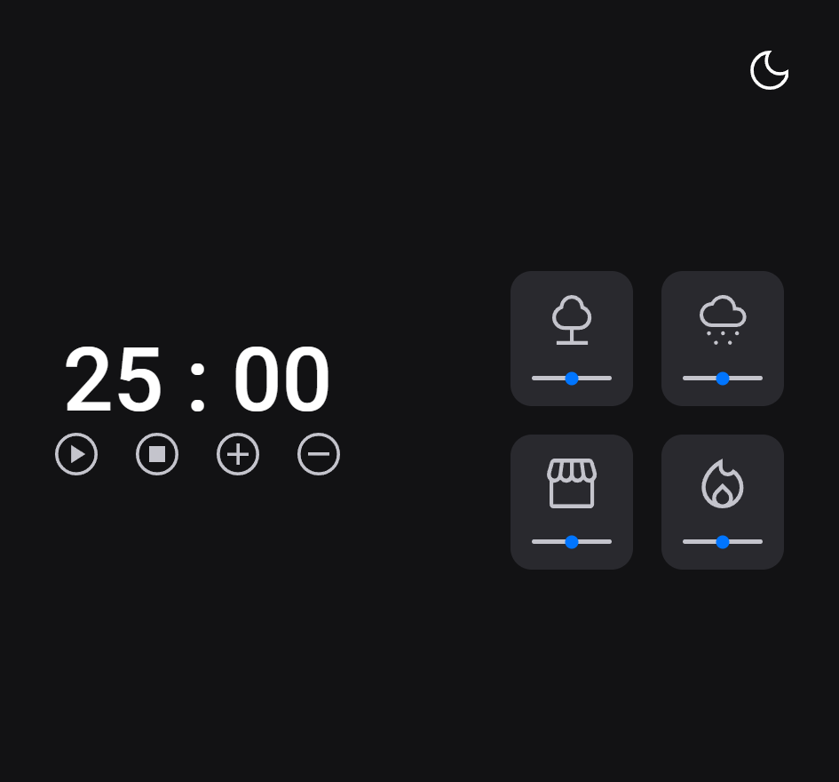

<h1 align="center"> Focus timer Dark Mode </h1>

Aplicação desenvolvida no Stage 05 do programa Explorer da Rocketseat.

  <a href="#-tecnologias">Tecnologias</a>&nbsp;&nbsp;&nbsp;|&nbsp;&nbsp;&nbsp;
  <a href="#-projeto">Projeto</a>&nbsp;&nbsp;&nbsp;|&nbsp;&nbsp;&nbsp;
  <a href="#-layout">Layout</a>&nbsp;&nbsp;&nbsp;|&nbsp;&nbsp;&nbsp;
  <a href="#memo-licença">Licença</a>

  

 

  

  

## 🚀 Tecnologias

Esse projeto foi desenvolvido com as seguintes tecnologias:

- HTML e CSS
- JavaScript
- Git e Github

## 💻 Projeto

Cronômetro com a funcionalidade de alterar entre o Dark Mode e o Light Mode. Além disso, conta com cards ao lado direito que, quando selecionados, mudam de cor e emitem sons diferentes entre si. Outrossim, é possível controlar o volume do som de cada card através de um slider embaixo de cada ícone. 

## 🔖 Layout

Você pode visualizar o layout do projeto através [DESSE LINK](<https://www.figma.com/file/YTPTEmrfeAD1c7NrXgV39F/Stage-05---Dark-Mode-FocusTimer-(Copy)?type=design&node-id=0-1&mode=design&t=V2s9PQbUs3kcEMkZ-0>). É necessário ter conta no [Figma](https://figma.com) para acessá-lo.

## :memo: Licença

Esse projeto está sob a licença MIT.

---